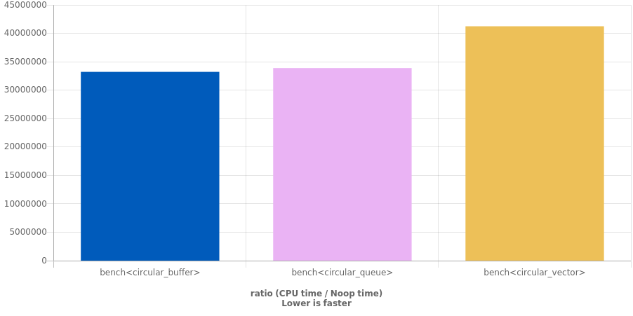

# Цикличный буфер

>На языке С++, написать минимум по 2 класса реализовывающих циклический буфер.
>Объяснить плюсы и минусы каждой реализации.

## База

В базу `circular_base.h` был вынесен общий шаблон последующих классов, интерфейс работы с ними, структура `Index` для работы с зацикленной индексацией, а также набор чистых виртуальных методов которые классы должны реализовывать. 

Для добавления элементов есть 2 метода - `push`, перезаписывающий данные и `push_safe` кидающий исключение при попытке добавить данные в полный буфер.

## `circular_aligned_storage`

На этом этапе возникла идея реализации такого буфера с помощью `std::aligned_storage`, к тому же у меня был опыт реализации схожей по управлению памятью конструкции `fixed_vector` ([GitHub](https://github.com/X-pech/fixed_vector)). Этот тайп-трейт необходим для реализации в `C++`-стиле выделения памяти без инициализации.

В этом классе объявляются соответствующие типы и `protected` интерфейс доступа к данным, чтобы была возможность хранения как по значению так и по указателю.

### `circular_buffer` 

В этой ситуации происходит чёрная магия памяти и выделяется место под `S` элементов типа `T` путём создания массива из `std::aligned_storage<sizeof(T), alignof(T)>::type`. Это позволяет *не инициализируя элементы выделить под множество таких элементов место в памяти, корректное по размеру и выравниванию*. 

Для инициализации элементов при добавлении их в буфер использутся `placement new`. 

### `circular_queue`

Неудачная попытка сделать `circular_buffer` в котором данные хранятся по укзаателю. Из-за архитектурных ограничений - бесполезен (изначально хотел реализовать `resize` но тогда ломался бы шаблон) + хоть и немного но проигрывает ему по времени.

## `circular_vector`

Реализация `circular_base` с применением `std::vector` как безопасной структуры. При инициализации используется `reserve` чтобы *сразу* выделить нужное количество памяти и сэкономить время на реаллокациях при расширении и далее до достижения необходимого размера (`S`) при добавлении в буфер используется `push_back` и только после - `operator[]`.

# Достоинства и недостатки

|Класс|+|-|
|-|-|-|
|`circular_buffer`|Скорость работы, статическая память|"Чёрная магия" с выделением памяти, `reinterpret_cast`-ы, `std::aligned_storage` is deprecated in `C++23`|
|`circular_queue`|Почти так же быстр как `circular_buffer`|"Чёрная магия" с выделением памяти, `reinterpret_cast`-ы, `std::aligned_storage` is deprecated in `C++23`, необходимость чистить выделенную память|
|`circular_vector`|Использование безопасных встроенных структур данных|Медленнее чем вышеперечисленные реализации|

# Дополнительно

Хотелось бы также заметить, что исходя из формулировки "буфер", а не "очередь" я решил что не стоит использовать реализации, не подразумевающие хранения данных в виде того или иного массива - я говорю о реализациях на основе связных списков: `std::list` или самописных.

Реализации на основе `std::deque` кажутся мне малоперспективными, потому что `std::deque` проигрывает `std::vector` по объему памяти и скорости доступа, а выигрывает по скорости расширения ([cppreference](https://en.cppreference.com/w/cpp/container/deque)), что не наш случай абсолютно.